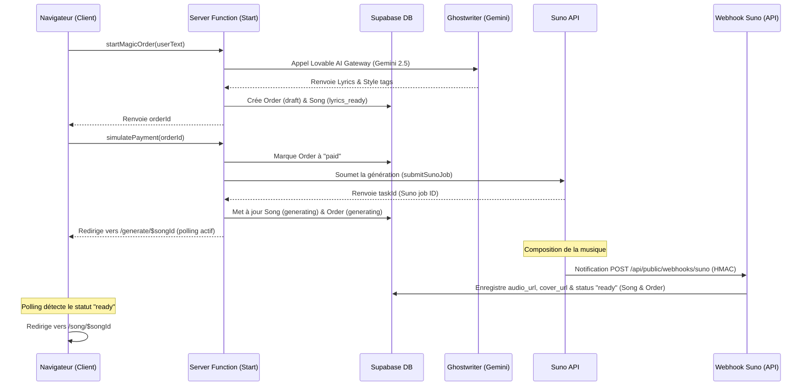

# Bible Produit — Mélodia (Source of Truth)

Ce document est la référence absolue pour le développement, la conception UX, le design system, et l'orchestration IA de Mélodia. Tous les modèles d'IA (Antigravity, Lovable, Cursor, Claude) doivent s'y aligner strictement pour garantir la cohérence et l'évolution homogène du projet.

---

## 1. Vision Produit : "Invisible Studio"

Mélodia est une plateforme de création de chansons personnalisées sur-mesure (paroles, mélodie et interprétation vocale) à destination du grand public en Afrique subsaharienne et de la diaspora.

### Le défi utilisateur
L'utilisateur mainstream ne sait pas rédiger des prompts d'IA ("prompt engineering"). L'exposer à des paramètres techniques produit de la friction et de la confusion.

### La solution : Zéro-friction
Mélodia agit comme un studio invisible. L'utilisateur raconte simplement son histoire ou dicte un mémo vocal. En arrière-plan, un orchestrateur IA traduit ce récit libre en paroles structurées et configure de manière optimale les paramètres de génération musicale (Suno Pro).

---

## 2. Principes UX et Émotionnels

### A. Chaleur Humaine et Connexion Émotionnelle
*   La musique est un vecteur d'émotions fortes (amour, gratitude, deuil, fierté). L'UI et les textes d'accompagnement doivent refléter cette sensibilité.
*   **Messages de chargement créatifs** : Durant l'attente, afficher des statuts contextualisés et chaleureux (ex: *"Extraction du groove afrobeat de ta référence..."*, *"Ajustement des chœurs..."*) au lieu de messages techniques froids.

### B. Accessibilité et Simplicité Mobile-First
*   L'application est conçue en priorité pour un usage sur smartphone.
*   **Entrée simplifiée** : L'accès à la création doit être immédiat avec un gros champ de saisie et une icône micro proéminente dès l'accueil.
*   **Paiement adapté** : Intégration claire et sans friction des opérateurs Mobile Money locaux.

---

## 3. Design System (Charte Graphique & UI)

Le design system est sombre, haut de gamme ("premium dark mode") et chaleureux, s'appuyant sur des teintes terreuses et dorées.

### A. Palette de Couleurs (Variables OKLCH)
Les jetons de couleurs s'appuient sur des variables sémantiques définies dans [styles.css](file:///c:/Users/admin/Downloads/getmelodia-main/getmelodia-main/src/styles.css) :
*   **`--base` (Background)** : `oklch(0.145 0.005 285)` — Un noir profond légèrement teinté.
*   **`--surface` (Card/Form Background)** : `oklch(0.21 0.006 285)` — Gris foncé pour détacher les éléments de surface.
*   **`--accent` (Primary Brand Color)** : `oklch(0.83 0.16 82)` — Un doré chaud et lumineux.
*   **`--accent-dark`** : `oklch(0.55 0.14 55)` — Doré assombri pour les états secondaires ou de survol.
*   **`--foreground` (Text Color)** : `oklch(0.985 0.002 285)` — Blanc cassé confortable pour la lecture.
*   **`--border`** : `oklch(1 0 0 / 8%)` — Ligne de démarcation subtile.

### B. Typographie
*   **Police sans-serif principale** : `"Instrument Sans"`, ui-sans-serif, system-ui, sans-serif.
*   Hiérarchie épurée favorisant de grands titres fins à forte personnalité et des textes de description lisibles.

### C. Arrondis & Bordures
*   **`--radius` (Base)** : `0.75rem` (12px) pour les boutons et petits éléments.
*   **Boutons principaux, Magic Input et Chips** : Fortement arrondis (`rounded-full` ou `rounded-3xl` / 24px) pour donner un aspect doux et moderne.

### D. Animations & Effets
*   **Waveform Bar** : Animation `@utility waveform-bar` simulant le mouvement d'égaliseurs audio (`wave-pulse 1.2s ease-in-out infinite`).
*   **Pulsations et Halos** : Halos radiaux dorés en arrière-plan avec animations d'opacité subtiles pour signifier le travail de l'IA.

---

## 4. Parcours Utilisateur

Mélodia propose deux parcours de création distincts :

```
[PARCOURS A : Magic One-Click (Par défaut)]
Accueil (Magic Input / Micro) ──► Validation & IA Ghostwriter ──► Redirection Auth ──► Paiement Mobile Money ──► Génération animée ──► Lecteur de Chanson

[PARCOURS B : Packs Spécifiques (Wizard)]
/packs (Liste des thèmes) ──► Sélection d'un Pack ──► Wizard en 10 étapes ──► Redirection Auth ──► Paiement Mobile Money ──► Génération animée ──► Lecteur de Chanson
```

### Description des étapes clés
1.  **Accueil** : Champ d'écriture libre avec raccourcis d'occasions populaires (Papa, Maman, Anniversaire, Mariage...).
2.  **Auth (`/auth`)** : Connexion simplifiée par e-mail/mot de passe ou via OAuth Google.
3.  **Paiement (`/paiement/$orderId`)** : Choix de l'opérateur Mobile Money (Orange, Airtel, M-Pesa, Africell) et saisie du numéro de téléphone.
4.  **Salle d'attente de Génération (`/generate/$songId`)** : Visualisation en temps réel de l'état d'avancement de la création.
5.  **Lecteur de Chanson (`/song/$songId`)** : Accès au fichier audio, onglet de paroles structurées, téléchargement direct du fichier MP3 et bouton de partage rapide sur WhatsApp.
6.  **Bibliothèque (`/library`)** : Liste filtrable de tous les morceaux commandés par l'utilisateur.

---

## 5. Fonctionnalités du MVP

*   **Magic One-Click** : Moteur de transcription vocale et analyse sémantique par IA.
*   **Catalogue Canonique de Packs** (défini dans [packs.ts](file:///c:/Users/admin/Downloads/getmelodia-main/getmelodia-main/src/lib/packs.ts)) : 19 catégories d'occasions (Femme, Fête des Mères, Papa, Anniversaire, Mariage, Naissance, Deuil/Hommage, Réussite/Diplôme, Louange/Église, Jingle Publicitaire, Hymne d'Entreprise, etc.).
*   **AI Ghostwriter & Compositeur** : Raccordement asynchrone à Gemini pour la scénarisation et à Suno pour l'audio.
*   **Système de Parrainage (Referrals)** : Code de parrainage unique distribué à l'inscription, avec attribution de commissions en FCFA pour chaque vente affiliée.
*   **Simulation Mobile Money** : Interface fonctionnelle permettant de tester le flux complet de paiement local.
*   **Application Web Progressive (PWA)** : Raccourci installable sur écran d'accueil mobile.

---

## 6. Règles de Production Musicale & IA (RÈGLES ABSOLUES)

### A. Formatage du `prompt_style` (Suno)
*   **Longueur maximale** : Strictement **120 caractères**.
*   **Contenu** : Tags en **anglais** uniquement, séparés par des virgules.
*   **JAMAIS de phrases** descriptives.
*   **JAMAIS de noms d'artistes ni de titres de morceaux** (sous peine de blocage par les filtres de sécurité Suno). Traduire systématiquement les références d'artistes en tags de genre/BPM/ambiance (Ex: *"Naza"* ➔ `afrobeat, french urban pop, danceable, upbeat, modern synth production, catchy rhythm`).

### B. Formatage des paroles (`suno_lyrics`)
*   **Langue** : Doit correspondre à la langue de la requête utilisateur (Français, Lingala, Kituba, Anglais ou Mixte).
*   **Structure concise** : **Max 2 couplets, 2 refrains, 1 pont, 1 outro** pour éviter que Suno ne coupe la chanson au milieu de la génération.
*   **Balises de structure** : Insérer obligatoirement des tags de structure entre crochets pour guider la composition (ex: `[Acoustic Intro]`, `[Verse 1]`, `[Chorus]`, `[Bridge]`, `[Melodic Outro]`).

### C. Filtre de Sécurité IA (Safety Filter)
*   Toute marque protégée ou nom déposé cité par l'utilisateur doit être automatiquement substitué par un équivalent générique avant la soumission à Suno.

---

## 7. Règles d'Implémentation & Code (RÈGLES ABSOLUES)

### A. Règle Critique Lovable (Préservation de l'Historique Git)
*   **Ne jamais réécrire l'historique Git publié** (pas de force push `git push -f`, pas d'amendement de commits déjà poussés `git commit --amend`, pas de rebase/squash interactif). Cela casse la synchronisation avec Lovable et peut entraîner la perte de l'historique utilisateur.

### B. Intégrité des Catalogues
*   Ne jamais modifier les listes d'occasions, de styles, d'émotions ou de langues canoniques sans accord explicite (références définies dans [catalog.ts](file:///c:/Users/admin/Downloads/getmelodia-main/getmelodia-main/src/lib/catalog.ts)).

### C. Structure de Code
*   **Style CSS** : Ne pas injecter de couleurs brutes (hardcoded colors) dans les classes Tailwind. Utiliser les variables de thèmes sémantiques (ex: `text-accent`, `bg-surface`, `border-border`).
*   **Enveloppe UI** : Toutes les nouvelles pages de l'application doivent être enveloppées dans les composants `<AppShell>` et `<BottomNav>` pour garantir la cohérence mobile.
*   **Fonctions Serveur** : Toutes les fonctions serveur (`createServerFn`) doivent valider leurs paramètres avec Zod et sécuriser l'accès avec le middleware `requireSupabaseAuth` (sauf webhook ou route d'API explicitement publique).

---

## 8. Architecture Technique

### Framework & Build
L'application utilise **Vite** comme outil d'assemblage et **Nitro** pour le déploiement serverless des routes API et fonctions serveur de TanStack Start.

### Modèle de Données (Base de données Supabase)
Le fichier [types.ts](file:///c:/Users/admin/Downloads/getmelodia-main/getmelodia-main/src/integrations/supabase/types.ts) définit la structure TypeScript des tables publiques :
*   `profiles` (id [PK], display_name, whatsapp, created_at)
*   `song_orders` (id [PK], user_id [FK], pack_slug, questionnaire, summary, status, plan, amount_fcfa, payment_ref, created_at)
*   `songs` (id [PK], order_id [FK], user_id [FK], title, style, language, lyrics, prompt, audio_url, cover_url, duration, status, suno_job_id, created_at)
*   `referrals` (id [PK], user_id [FK, Unique], code [Unique], uses, credits_fcfa, created_at)
*   `user_roles` (id [PK], user_id [FK], role, Unique(user_id, role))

### Cycle de Vie d'une Génération de Chanson


